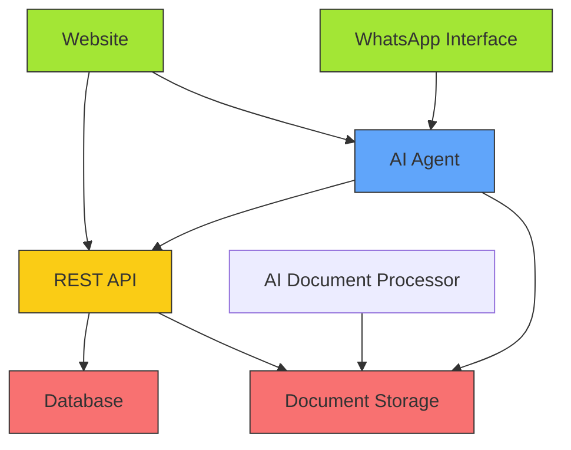

# Architecture

 
## Backend
- Database
- Document storage (word, pdf, videos, images...)
- REST API - extensive, stable, well-documented. To operate on the above two.
## AI Agent 
- Chat with the user (through frontends)
- Understands both English and Tok Pisin
- Can process audio messages
- Can access API on behalf of the user (same permissions)
- Can read documents and search information through them
- Can receive files to upload as documents 
- Content edited by the agent is flagged as such
## AI document processor
- Operates asynchronously on uploaded documents 
- Functions:
    - Translation
    - Summaries
    - Simplification 
    - Modality change (e.g. video to text, text to audio...)
- Some run on each new document uploaded (e.g. translation), some on demand (e.g. modality changes)
## Website 
- Frontend using the REST API
- Landing page, user profiles...
- Mapping functionality to display data from database
- Shows chat interface to the AI Agent 
## Whatsapp interface 
- Other interface to AI Agent 
- Whatsapp bot that can be messaged by users
- User authentication through their phone number 
- Accepting text or voice messages, and attachments like images, video, files, to become documents
- Leveraging Whatsapp capability to write messages offline and deliver when online 
 
